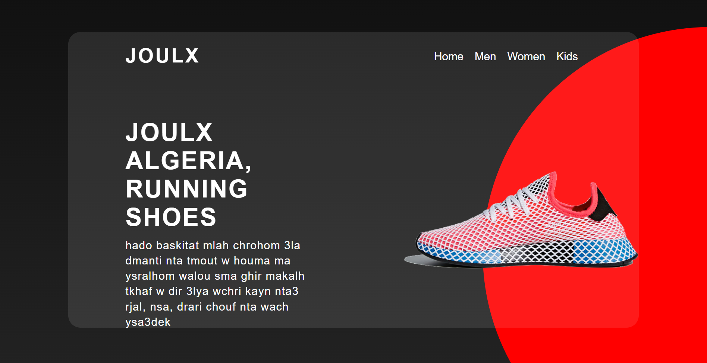

# Joulx Shoes Landing Page

Welcome to the Joulx Shoes Landing Page project! This is a simple yet elegant landing page created using HTML and CSS, showcasing a fictional shoe brand, Joulx.

## Preview

  
*Include a screenshot of your project in the repository.*

## Features

- Responsive design that adapts to different screen sizes.
- Modern navigation bar for easy access to different sections.
- Attractive background with a gradient effect and clip-path for unique styling.
- Call-to-action buttons for account creation and product purchase.

## Technologies Used

- HTML
- CSS

## Getting Started

To get a copy of this project up and running on your local machine, follow these simple steps:

1. Clone the repository:
   ```bash
   git clone https://github.com/NoureddineBou/HTML-CSS-JS-mini-projects.git
